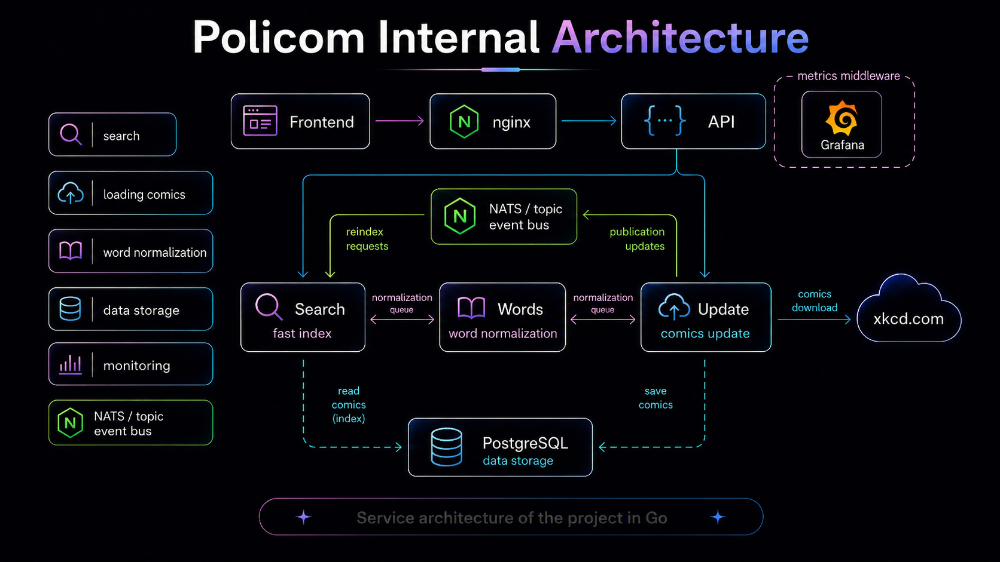
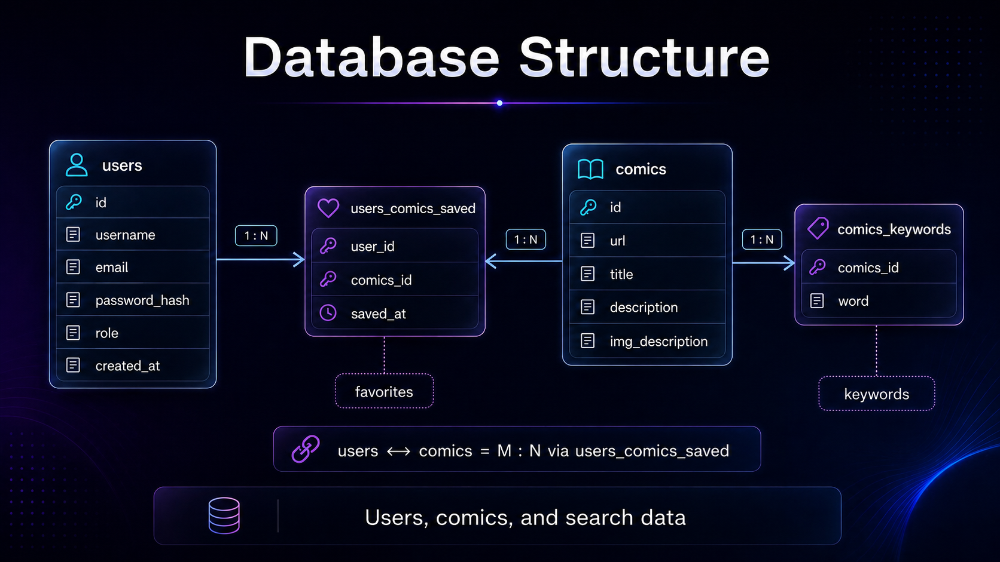

# Policom
[🇷🇺 Читать на Русском](README_ru.md)

A microservice system for searching [XKCD](https://xkcd.com) comics by keyword, built in Go using **Hexagonal Architecture** (Ports & Adapters).

---

## Architecture

The system is split into four independent Go services:

| Service    | Responsibility                                                                 |
|------------|--------------------------------------------------------------------------------|
| **API**    | HTTP gateway — routing, auth middleware, rate limiting, concurrency control     |
| **Update** | Fetches comics from xkcd.com via worker pool, saves to PostgreSQL, publishes NATS events |
| **Words**  | Word normalization and stemming (snowball + stop-words) over gRPC              |
| **Search** | Maintains an in-memory inverted index with IDF scoring, handles search queries  |

**Request flows:**
- 🔍 Search: `Client → nginx → API → Search (gRPC) → response`
- 🔄 Index update: `Admin → API → Update (gRPC) → xkcd.com → PostgreSQL → NATS event → Search rebuilds index`

NATS is used for communication between Update and Search.



---

## Database

| Table                 | Description                                               |
|-----------------------|-----------------------------------------------------------|
| `users`               | Registered users (id, username, email, password_hash, role, created_at) |
| `comics`              | Comics metadata (id, url, title, description, img_description) |
| `users_comics_saved`  | M:N — users' saved (favourite) comics, with timestamp     |
| `comics_keywords`     | Normalized keywords per comic, used for index building    |



---

## Tech Stack


| Layer            | Technology                                                  |
|------------------|-------------------------------------------------------------|
| 🌐 Transport     | HTTP (`net/http`), gRPC + Protobuf                          |
| 📨 Broker        | NATS (async index rebuild events)                           |
| 🗄️ Storage      | PostgreSQL, in-memory inverted index (IDF scoring)   |
| 🔐 Auth          | JWT (admin endpoints, TTL-based)                            |
| 🔄 Migrations    | `golang-migrate`                                            |
| 🚦 Proxy         | nginx                                                       |
| 📊 Monitoring    | Prometheus + Grafana dashboards + Grafana Loki (log aggregation) |
| 📄 Docs          | Swagger                                                     |
| 🐳 Infra         | Docker, Docker Compose, Makefile, GitHub Actions CI/CD      |

---

## Hexagonal Architecture

Each service strictly follows the **Ports & Adapters** pattern:

- **Ports** — Go interfaces that express what the domain needs (e.g. `ComicsRepository`, `SearchClient`, `EventPublisher`)
- **Adapters** — concrete implementations wired at startup (PostgreSQL, gRPC clients, NATS publisher, HTTP handlers)
- The domain core has no imports of infrastructure packages — only interfaces

This keeps each service independently testable and allows swapping any adapter without touching business logic.


## Quick Start

**Requirements:** Docker, Docker Compose, `make`

```bash
git clone https://github.com/r4cy/Policom.git
cd Policom
make up
```

| Service  | URL                                   |
|----------|---------------------------------------|
| Frontend | http://localhost:2300                 |
| API      | http://localhost:28080                |
| Swagger  | http://localhost:28080/swagger/       |
| Metrics  | http://localhost:28080/metrics        |

---

## API Reference

### General

| Method | Path        | Description                      | Auth |
|--------|-------------|----------------------------------|------|
| `GET`  | `/api/ping` | Health check across all services | —    |

### Auth

| Method | Path                 | Description        | Auth |
|--------|----------------------|--------------------|------|
| `POST` | `/api/login`         | Login, returns JWT | —    |
| `POST` | `/api/auth/register` | Register new user  | —    |

### Profile & Favourites

| Method   | Path                 | Description                  | Auth |
|----------|----------------------|------------------------------|------|
| `GET`    | `/api/me`            | Get current user profile     | ✅   |
| `POST`   | `/api/me/saved/{id}` | Save comic to favourites     | ✅   |
| `DELETE` | `/api/me/saved/{id}` | Remove comic from favourites | ✅   |

### Comics & Search

| Method | Path               | Description                                      | Limit              |
|--------|--------------------|--------------------------------------------------|--------------------|
| `GET`  | `/api/comics/{id}` | Get single comic by ID                           | Rate limited       |
| `GET`  | `/api/search`      | Full-text search via PostgreSQL (`?phrase=...`)  | Concurrency limit  |
| `GET`  | `/api/isearch`     | Fast search via in-memory index (`?phrase=...`)  | Rate limited       |

### Admin

| Method   | Path              | Description                        | Auth          |
|----------|-------------------|------------------------------------|---------------|
| `POST`   | `/api/db/update`  | Trigger comics fetch from xkcd.com | ✅ Admin only |
| `GET`    | `/api/db/stats`   | Fetch update statistics            | ✅ Admin only |
| `GET`    | `/api/db/status`  | Check current update job status    | ✅ Admin only |
| `DELETE` | `/api/db`         | Drop the database                  | ✅ Admin only |
