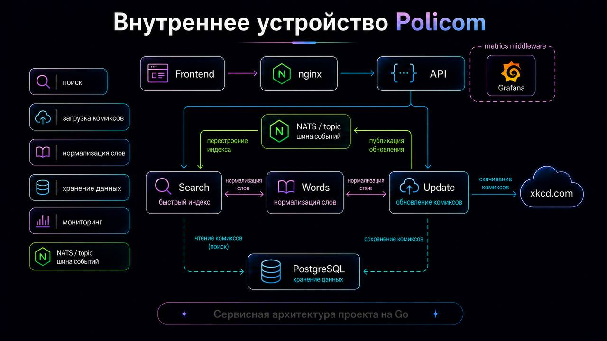
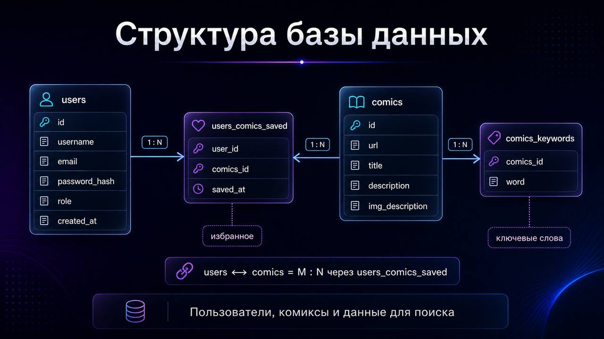

# Policom
[en Read in English](README.md)

Микросервисная система для поиска комиксов [XKCD](https://xkcd.com) по ключевым словам, написанная на Go с использованием **Гексагональной архитектуры** (Порты и Адаптеры).

---

## Архитектура

Система разделена на четыре независимых Go-сервиса:

| Сервис     | Ответственность                                                                 |
|------------|---------------------------------------------------------------------------------|
| **API**    | HTTP-шлюз — маршрутизация, middleware аутентификации, rate limiting, контроль конкурентности |
| **Update** | Загружает комиксы с xkcd.com через пул воркеров, сохраняет в PostgreSQL, публикует события в NATS |
| **Words**  | Нормализация и стемминг слов (snowball + стоп-слова) через gRPC               |
| **Search** | Поддерживает инвертированный индекс в памяти с IDF-скорингом, обрабатывает поисковые запросы |

**Потоки запросов:**
- 🔍 Поиск: `Client → nginx → API → Search (gRPC) → ответ`
- 🔄 Обновление индекса: `Admin → API → Update (gRPC) → xkcd.com → PostgreSQL → событие NATS → Search перестраивает индекс`

NATS используется для взаимодействия между Update и Search.



---

## База данных

| Таблица               | Описание                                                  |
|-----------------------|-----------------------------------------------------------|
| `users`               | Зарегистрированные пользователи (id, username, email, password_hash, role, created_at) |
| `comics`              | Метаданные комиксов (id, url, title, description, img_description) |
| `users_comics_saved`  | M:N — сохранённые (избранные) комиксы пользователей с временной меткой |
| `comics_keywords`     | Нормализованные ключевые слова для каждого комикса, используются при построении индекса |



---

## Технологический стек


| Слой             | Технология                                                  |
|------------------|-------------------------------------------------------------|
| 🌐 Транспорт     | HTTP (`net/http`), gRPC + Protobuf                          |
| 📨 Брокер        | NATS (асинхронные события перестройки индекса)              |
| 🗄️ Хранилище    | PostgreSQL, инвертированный индекс в памяти (IDF-скоринг)   |
| 🔐 Аутентификация| JWT (admin-эндпоинты, с TTL)                                |
| 🔄 Миграции      | `golang-migrate`                                            |
| 🚦 Прокси        | nginx                                                       |
| 📊 Мониторинг    | Prometheus + дашборды Grafana + Grafana Loki (агрегация логов) |
| 📄 Документация  | Swagger                                                     |
| 🐳 Инфраструктура| Docker, Docker Compose, Makefile, GitHub Actions CI/CD      |

---

## Гексагональная архитектура

Каждый сервис строго следует паттерну **Порты и Адаптеры**:

- **Порты** — Go-интерфейсы, выражающие потребности домена (например, `ComicsRepository`, `SearchClient`, `EventPublisher`)
- **Адаптеры** — конкретные реализации, подключаемые при запуске (PostgreSQL, gRPC-клиенты, NATS-паблишер, HTTP-хендлеры)
- Доменное ядро не импортирует инфраструктурные пакеты — только интерфейсы

Это позволяет тестировать каждый сервис независимо и менять любой адаптер без изменения бизнес-логики.

---

## Быстрый старт

**Требования:** Docker, Docker Compose, `make`

```bash
git clone https://github.com/r4cy/Policom.git
cd Policom
make up
```

| Сервис    | URL                                   |
|-----------|---------------------------------------|
| Frontend  | http://localhost:2300                 |
| API       | http://localhost:28080                |
| Swagger   | http://localhost:28080/swagger/       |
| Метрики   | http://localhost:28080/metrics        |

---

## Справочник API

### Общее

| Метод  | Путь        | Описание                                 | Auth |
|--------|-------------|------------------------------------------|------|
| `GET`  | `/api/ping` | Health check всех сервисов               | —    |

### Аутентификация

| Метод  | Путь                 | Описание             | Auth |
|--------|----------------------|----------------------|------|
| `POST` | `/api/login`         | Вход, возвращает JWT | —    |
| `POST` | `/api/auth/register` | Регистрация нового пользователя | —  |

### Профиль и избранное

| Метод    | Путь                 | Описание                       | Auth |
|----------|----------------------|--------------------------------|------|
| `GET`    | `/api/me`            | Получить профиль текущего пользователя | ✅ |
| `POST`   | `/api/me/saved/{id}` | Добавить комикс в избранное    | ✅   |
| `DELETE` | `/api/me/saved/{id}` | Удалить комикс из избранного   | ✅   |

### Комиксы и поиск

| Метод  | Путь               | Описание                                              | Лимит              |
|--------|--------------------|-------------------------------------------------------|--------------------|
| `GET`  | `/api/comics/{id}` | Получить комикс по ID                                 | Rate limited       |
| `GET`  | `/api/search`      | Полнотекстовый поиск через PostgreSQL (`?phrase=...`) | Лимит конкурентности |
| `GET`  | `/api/isearch`     | Быстрый поиск через индекс в памяти (`?phrase=...`)   | Rate limited       |

### Администрирование

| Метод    | Путь              | Описание                               | Auth          |
|----------|-------------------|----------------------------------------|---------------|
| `POST`   | `/api/db/update`  | Запустить загрузку комиксов с xkcd.com | ✅ Только admin |
| `GET`    | `/api/db/stats`   | Получить статистику обновлений         | ✅ Только admin |
| `GET`    | `/api/db/status`  | Проверить статус текущей задачи обновления | ✅ Только admin |
| `DELETE` | `/api/db`         | Очистить базу данных                   | ✅ Только admin |
